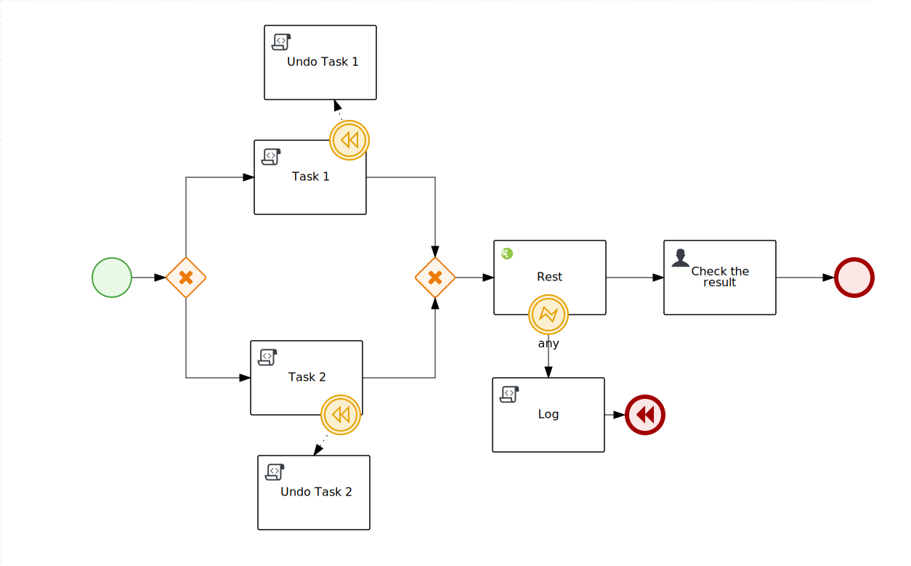
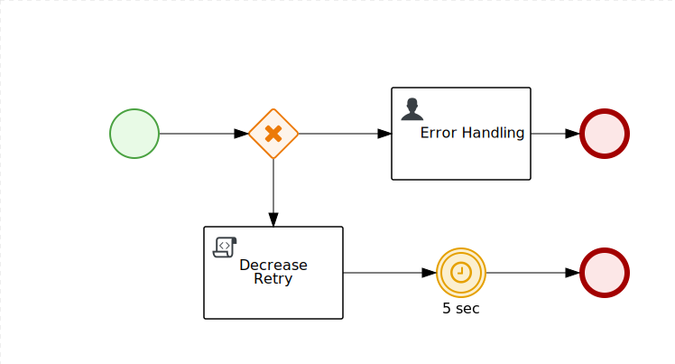

Error Handling Strategy
=======================

Usage example of error handling stragegies.

**This project can be imported in the Business Central**

To understand the motivation behind it see:

- [Reducing data inconsistencies with Red Hat Process Automation Manager](https://developers.redhat.com/blog/2018/08/22/reducing-data-inconsistencies-with-red-hat-process-automation-manager/)

The Error Handling strategy is a feature of the process engine that delegate a specific process to manage the exception raised by the main project:

Main process:

The REST call raise an exception that is handled by the following process:

The error handling process triggers a **retry strategy** once after 5 seconds of delay.

Since the REST call fails again the _error handling_ process is launched again, the retry counter now is 0, so the logic rethrow the error back to the main process.

In the main process the error is caught and finally trigger the compensation.